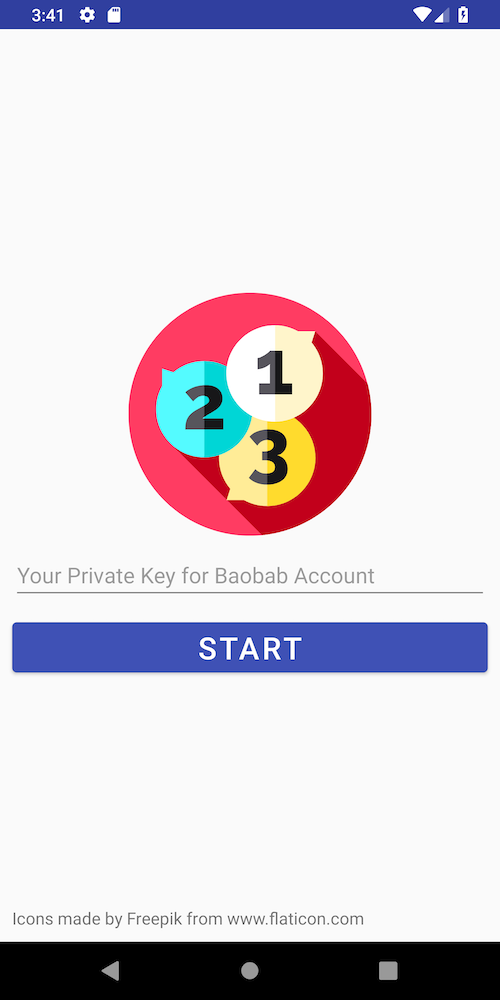

# Count BApp for Android

Count BApp for Android (Count) is an Android implementation (Java) demonstrating the simple use of [caver-java](https://github.com/klaytn/caver-java). The primary purpose of Count is to highlight **Klaytn Fee Delegation** mechanism with an arbitrary fee delegator.



## How to Use
You can fork this repository and run the project on [Android Studio](https://developer.android.com/studio). 
This way, you can run emulators of your choice to test the app without having physical devices.

## Fee Delegation
Count uses Klaytn Fee Delegation to enable users to send tranasctions without paying transaction fees. 

The idea is that if there is a fee delegator, **FD**, with fee delegation key **FDK**, all transactions sent from **accounts with zero balance** can be included in blocks as long as they have **additional signatures** verfiable by the public key derived from **FDK**. 

Users wishing to send transactions using fee delegation must find a fee delegator (just like **FD**) and send their transactions to him/her in order to get valid signatures. Detailed explanation regarding fee delegation is in [here](https://forum.klaytn.com/t/fee-delegation-explained/31).


## How Count Uses Fee Delegation
Count uses HTTP for sending fee delegated transactions, and assumes there exists a fee delegator, called **payer**, who has implemented a REST interface like this:

```
POST /payer
```

Here's an example payload that Count sends to a payer:

```
{
    "senderRawTx": "0x1234ABCD5678...EF90" 
}
```

Payers accept and process user submitted transactions as described in [here](https://forum.klaytn.com/t/fee-delegation-explained/31), and send responses containing transaction hashes. In case of failures (e.g., server failure, network disconnection, failed transactions), the payer responds with proper error messages describing the nature of failure.

An example payer implementation is available at [KlaytnDevelopers/payer-express](https://github.com/KlaytnDevelopers/payer-express). Simply clone and run the payer using `npm start` with required environment variables (`FEE_PAYER_KEY` and `FEE_PAYER_ADDRESS`; for more information, please follow the instruction available in the payer-express repository). 

FYI, if you run payer-express on your local machine (i.e., localhost) and wish to use it from the emulator, make sure you point to `10.0.2.2:3000`, not `localhost:3000`.